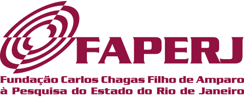

The PINGA lab has been funded through research grants, fellowships, and post-graduate
scholarships from several funding agencies:

These are some of the funded grants and fellowships that supported our research.
